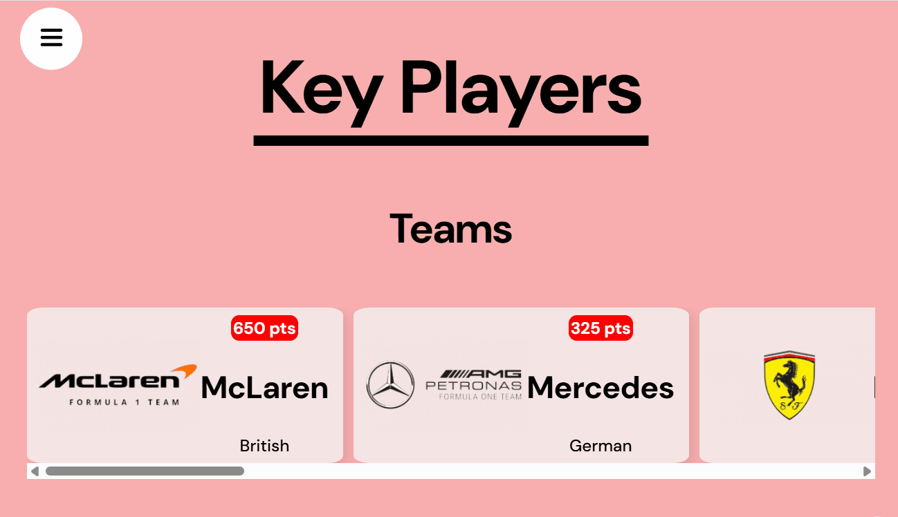

# 🏎️ Formula 1 Live Dashboard

A modern, interactive **Formula 1 web experience** built with **React** and **Framer Motion**, featuring real-time data, smooth animations, and a dynamic user interface that brings the thrill of F1 directly to your screen.

This project combines live API data with advanced UI motion design to deliver an engaging and visually rich exploration of the world of Formula 1.

---

### 🏁 Real-Time Formula 1 Data

- Live updates for **drivers**, **teams**, and **race standings** via external F1 APIs
- Information about **upcoming races** and **circuit details**
- Interactive links to deeper information on each driver, team, and circuit

### 🎞️ Immersive Motion Design

- Custom **Framer Motion animations** throughout
- Unique **parallax scroll effect** where an F1 car dives down the track as you scroll
- Animated **hero section** with sliding background text
- Smooth **scroll-based progress bar** and **cursor-following circle** for interactive feedback
- **Sidebar menu** for quick navigation between sections

- Sections covering:
  - Drivers & Teams
  - Circuits
  - Upcoming Races
  - Race Weekend Layout
  - Key Terms & F1 Basics

---

### Prerequisites

Before you start, make sure you have Node.js installed on your machine: (https://nodejs.org/en/download/)

### Installation

Run the following command to install the necessary dependencies:

```bash
npm install
```

### Running the project

To start the development server, run the following command:

```bash
npm run dev
```

This will start the server and open your default browser to your localhost. The site will reload automatically as you make changes to your code.

---

## Demo

Here are some screenshots of it in motion:



